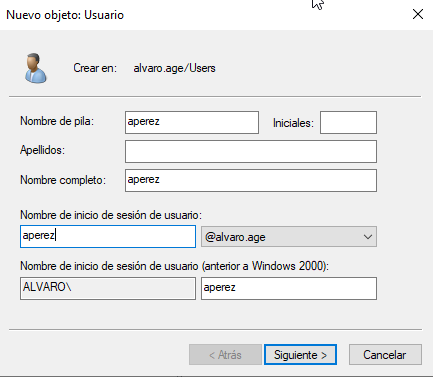
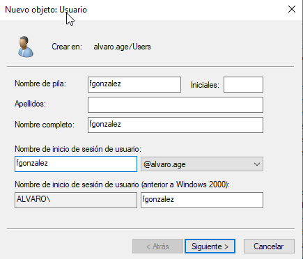
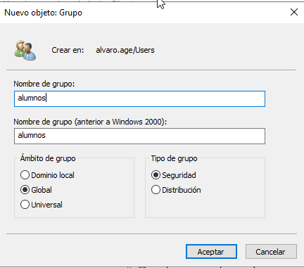
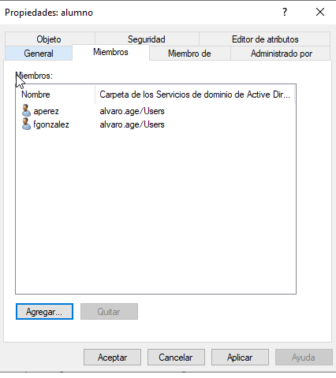
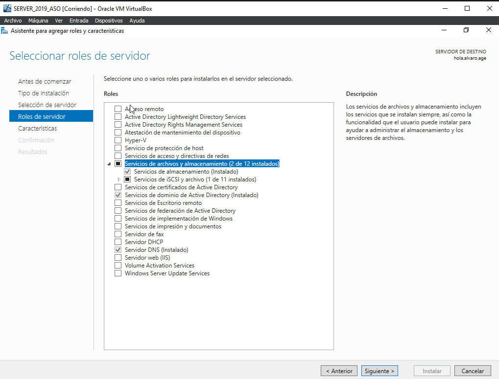
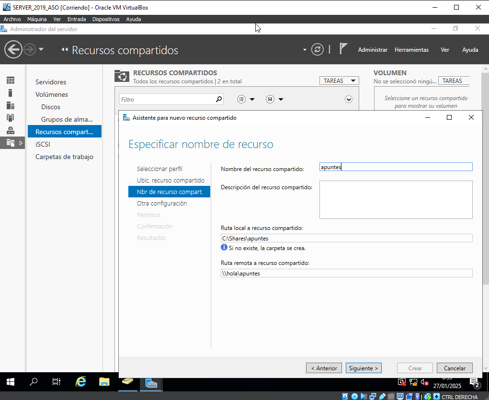
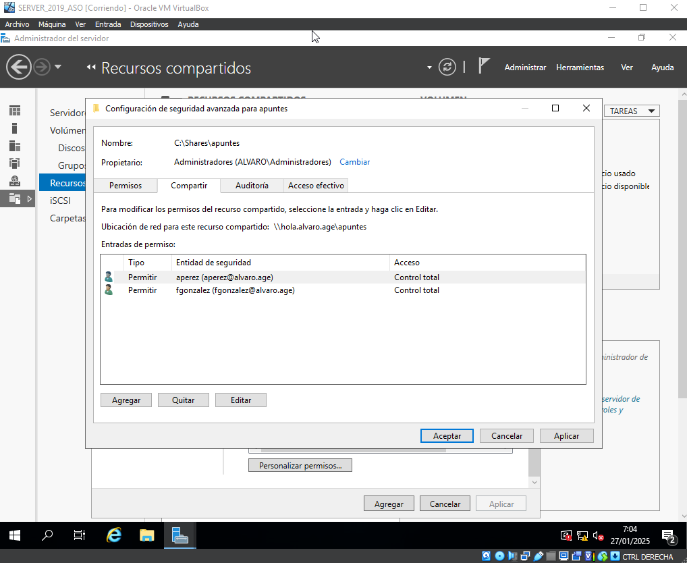
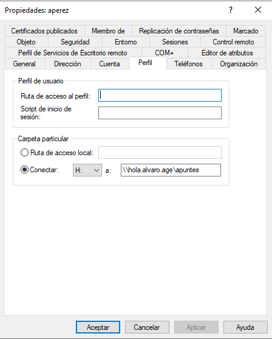
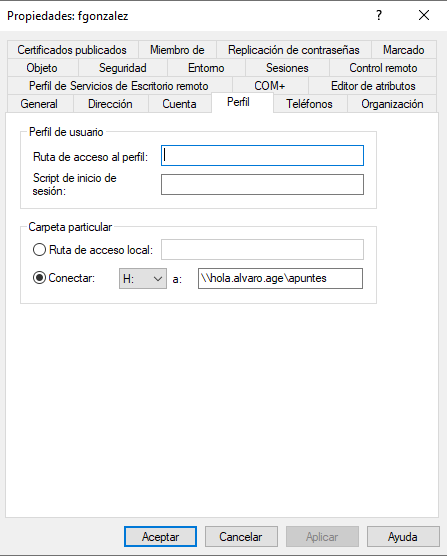
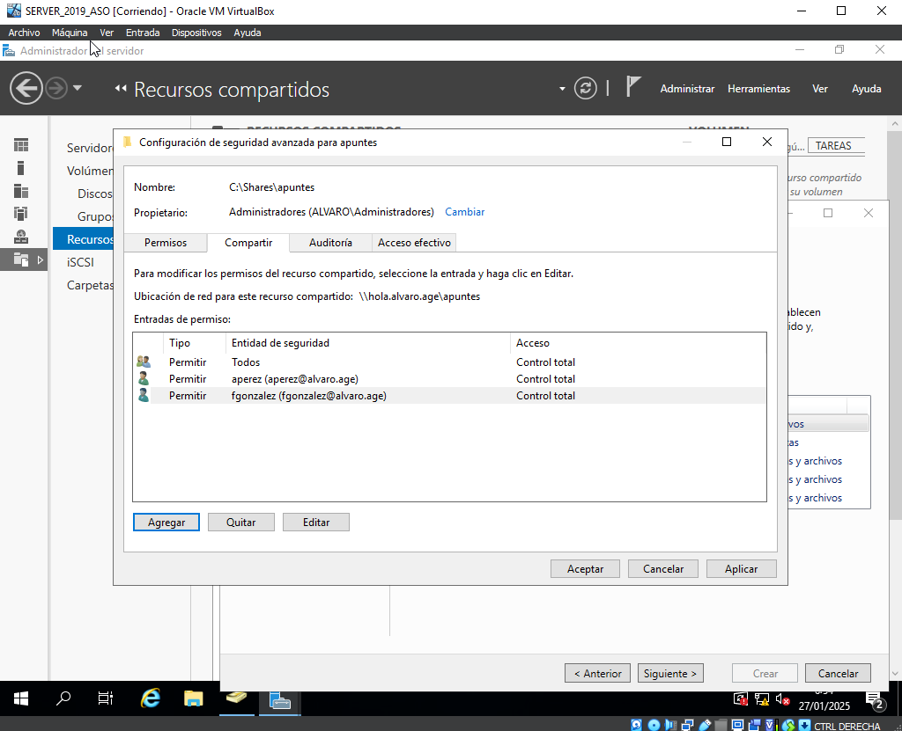

# PR0501: Carpetas personales y compartidas por un grupo

Realiza los siguiente pasos en tu dominio:

## Creación de usuarios y grupos

- Crea en tu dominio los usuarios `aperez` y `fgonzalez`.

    - Para crear los usuarios primero  debemos ir a usuarios y equipos de active directory, aqui iremos a usuarios y dentro de este haremos clic derecho,nuevo,usuario

 

- Crea un grupo global denominado `alumnos` y agrega los usuarios que creaste anteriormente.

    - Para hacer el grupo haremos clic derecho ,nuevo,grupo.

-   Para agregar a los usuarios al grupo entraremos en propiedades del grupo,miembros le daremos a agregar y añadiremos los dos usuarios anteriores.

## Carpetas personales

- Instala el *Administrador de recursos del servidor de archivos* que está dentro del rol *Servicios de archivos y almacenamiento*

- Utilizando la herramienta *Servicios de archivos y de almacenamiento* del *Administrador del servidor*, crea una carpeta para cada usuario dentro de `C:\shares` y realiza los pasos necesarios para que ambos usuarios puedan ver esta carpeta como una unidad de red identificada con la letra `H:`

-   Iremos a recursos compartidos y añadir nuevo, una vez aqui pondremos el nombre de la carpeta

-   Los permisos y la crearemos

-   Una vez creada pillaremos cada ruta de acceso y la pegaremos en la carpeta particular de los dos usuarios con la letra H (dentro de propiedades en cada usuario)

- Comprueba que la carpeta de cada usuario solo pueda ser accedida por él mismo.

## Carpetas compartidas por un grupo

- Crea en `C:\shares` una carpeta llamada `apuntes` y realiza las tareas necesarias para que los usuarios del grupo `alumnos` puedan acceder a ella como un espacio de almacenamiento compartido.

## Entrega de la tarea

Debes documentar los pasos más relevantes de la misma y entregarla en el repositorio.